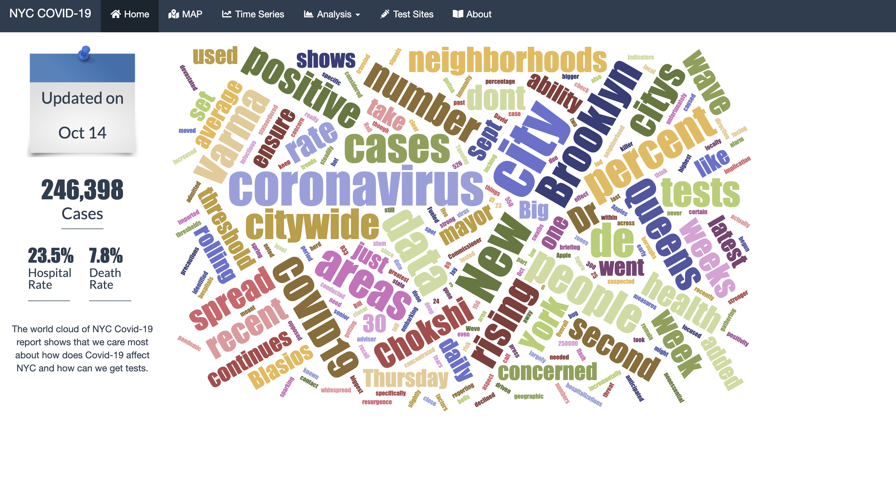
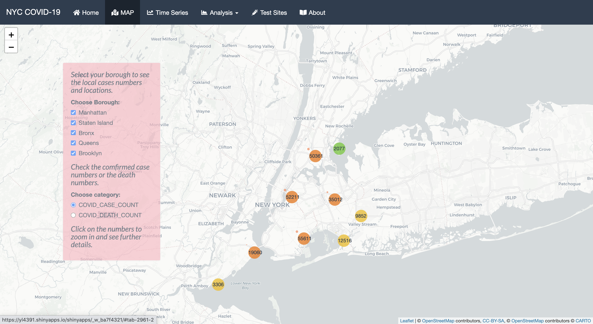
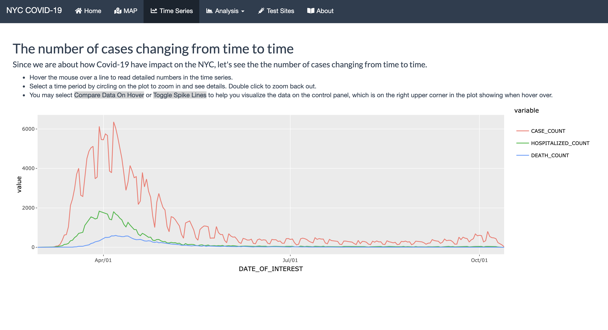
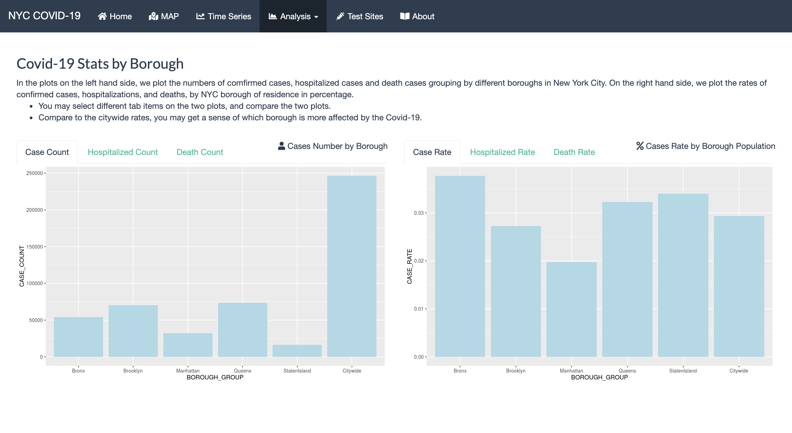
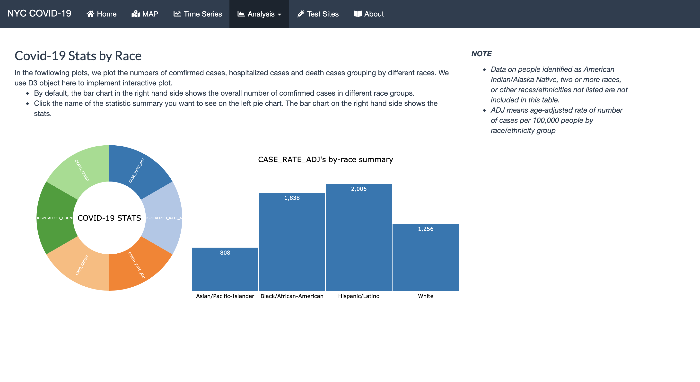
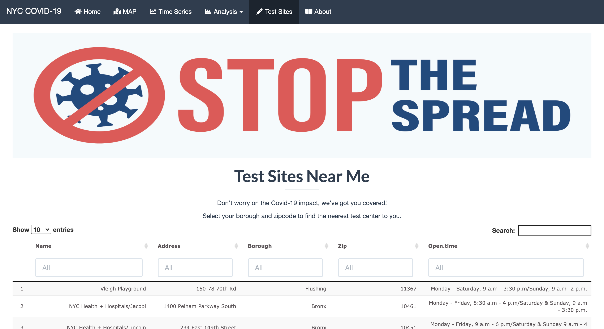

# Project 2: Shiny App Development

### [Project Description](doc/project2_desc.md)









In this second project of GR5243 Applied Data Science, we develop a *Exploratory Data Analysis and Visualization* shiny app on a topic of your choice using [JHU CSSE Covid-19 Data](https://github.com/CSSEGISandData/COVID-19) or NYC Health open data released on the [NYC Coronavirus Disease 2019 Data](https://github.com/nychealth/coronavirus-data) website. See [Project 2 Description](doc/project2_desc.md) for more details.  

The **learning goals** for this project is:

- business intelligence for data science
- study legacy codes and further development
- data cleaning
- data visualization
- systems development/design life cycle
- shiny app/shiny server

*The above general statement about project 2 can be removed once you are finished with your project. It is optional.

## Coronavirus Information Summary in NYC
Term: Fall 2020

+ Team #6
+ Shiny Link: https://yl4391.shinyapps.io/Fall2020-Project2-Group6/

+ **Team members**:
	+ Feng, Xinying
	+ Liang, Yue
	+ Sun, Xiaoli
	+ Wang, Hanyi

+ **Project summary**:

Ever since the outbreak of COVID-19 last year, millions of people were taken by the disease. The widespread virus not only brought crushing effects to the economy and politics around the world but also even reshaped everybody’s lifestyles. From being anxious in panic, doubts, and worries, to living along with the virus while actively finding ways out, the word COVID-19 remains an influential issue to all humanity in 2020. In face of a pandemic disaster, the transparency of information is undoubtfully important, providing people with an accurate understanding of the situation they are facing.

Our map, like many other online information platforms, aims at presenting general information about COVID-19 to people in need. By using the dataset from NYC open data, we perform the visualization of NYC COVID-19 cases directly on the map column, and the brief analysis of demographic distribution. The time-series graph of the past three months’ development of COVID also provided users with the trend in NYC.

+ **Contribution statement**: ([default](doc/a_note_on_contributions.md)) 

Yue Liang contributed the User Interface, Shiny Server, Home and About page design, several the Statistical Analysis plots to the App.

Xinying Feng contributed the Map function and Search Box function to the App.

Xiaoli Sun contributed several Statistical Analysis plots and the World Cloud to the App.

Hanyi Wang contributed to the App as a presenter. Hanyi Wang contributed less than other teammates due to personal reasons.

All team members approve our work presented in this GitHub repository including this contributions statement.

Following [suggestions](http://nicercode.github.io/blog/2013-04-05-projects/) by [RICH FITZJOHN](http://nicercode.github.io/about/#Team) (@richfitz). This folder is orgarnized as follows.

```
proj/
├── app/
├── lib/
├── data/
├── doc/
└── output/
```

Please see each subfolder for a README file.

